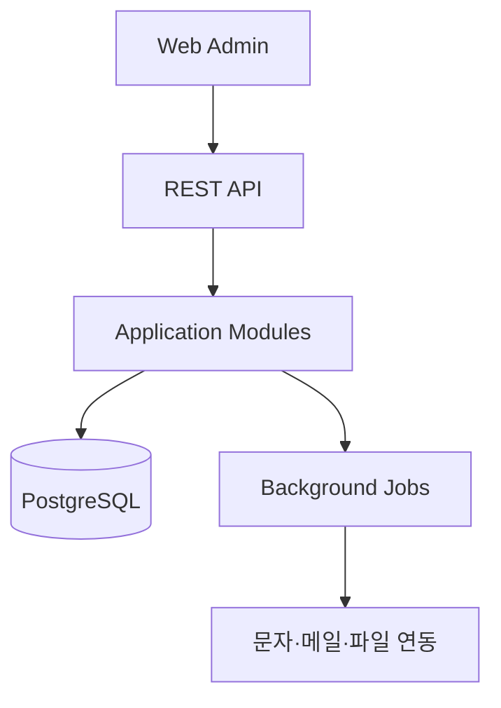
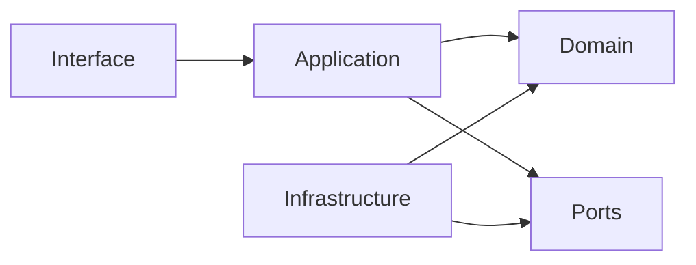

# 시스템 아키텍처

## 방향

초기에는 하나의 배포 단위 안에서 모듈 경계를 엄격히 유지하는 **Modular Monolith**를
사용한다. 교회 규모의 운영 복잡도에서는 마이크로서비스보다 배포와 트랜잭션 관리가
단순하며, 향후 규모가 커질 때 경계가 검증된 모듈만 분리할 수 있다.

## 모듈

| 모듈 | 책임 | 대표 Entity |
|---|---|---|
| Identity | 사용자, 역할, 권한, 로그인 정책 | User, Role, Permission |
| Member | 교인 기본 정보와 교적 상태 | Member, MemberStatusHistory |
| Household | 가족/세대와 관계 | Household, HouseholdMembership |
| Organization | 교구, 구역, 부서, 교회학교 | Organization, OrganizationMembership |
| Position | 직분과 임명 이력 | Position, PositionAppointment |
| Newcomer | 새가족 등록·정착 과정 | NewcomerJourney, FollowUp |
| Attendance | 예배·모임과 출석 | Gathering, AttendanceRecord |
| Pastoral Care | 심방, 상담, 기도 요청 | Visit, CareNote |
| Offering | 헌금 접수·배치·헌금 종류 | Offering, OfferingBatch, OfferingType |
| Accounting | 계정과목, 분개, 예산, 마감 | Account, JournalEntry, Budget |
| Document | 증명서와 기부금영수증 | DocumentTemplate, IssuedDocument |
| Audit | 중요 행위의 변경 추적 | AuditEvent |

## 의존성 원칙

- Domain은 framework, HTTP, ORM에 의존하지 않는다.
- Application은 use case와 트랜잭션 경계를 정의한다.
- Infrastructure는 DB, 메시지, 외부 연동 adapter를 제공한다.
- Interface는 REST 요청을 application command/query로 변환한다.

## 배포 단위

초기 배포 단위는 다음 세 가지다.

1. `web`: 관리자와 사역자용 SPA
2. `api`: 인증, 업무 API, background worker 진입점
3. `postgres`: 영속 데이터 저장소

파일 첨부는 로컬 디스크가 아니라 S3 호환 object storage interface를 사용한다.
개발 환경에서는 호환 로컬 서비스를 사용할 수 있고 운영 환경 구현은 배포 ADR로
결정한다.

## Multi-church 준비

초기 설치가 단일 교회이더라도 주요 업무 테이블에 `church_id`를 두어 데이터 경계를
명시한다. 단, SaaS 운영과 요금제는 v1 범위에 포함하지 않는다. 모든 repository query는
현재 church scope를 필수로 받아야 한다.

## 비동기 처리

대량 내보내기, 기부금영수증 생성, 알림 발송, 통계 집계는 background job으로 실행한다.
DB 변경과 외부 발송의 정합성에는 transactional outbox 도입을 우선 검토한다.

## 상세 문서

- [도메인 모델](docs/architecture/domain-model.md)
- [데이터베이스](docs/architecture/database.md)
- [API 설계](docs/architecture/api-design.md)
- [보안](docs/architecture/security.md)
