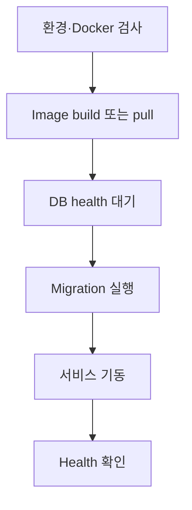

# 서버 PC Docker 배포

## 목표

교회 서버 PC에서 운영자가 애플리케이션 내부 구조를 몰라도 한 명령으로 안전하게
설치·업그레이드·기동할 수 있게 한다.

```bash
./deploy/server-up.sh
```

최초 설치 때만 `deploy/.env.production.example`을 복사해 `.env.production`을 만들고
비밀번호, session secret, 공개 주소, timezone을 설정한다. 이후에는 같은 명령을 반복한다.

## Production Compose 구성

| Service | 역할 | 외부 노출 |
|---|---|---|
| gateway | HTTP(S) 진입점, 정적 Web, API reverse proxy | 지정 port만 노출 |
| web | frontend production build | 내부 network |
| api | 업무 API와 worker | 내부 network |
| migrate | API image를 사용한 one-shot DB migration | 노출 없음 |
| postgres | 영속 DB | host에 직접 노출하지 않음 |

## 기동 순서



`server-up.sh`는 `set -euo pipefail`을 사용하고 각 단계가 실패하면 non-zero로 종료한다.
성공 메시지는 gateway와 API health가 모두 확인된 뒤에만 표시한다.

## 영속 데이터

- PostgreSQL data: named volume
- 사용자 업로드: named volume 또는 외부 S3 호환 storage
- application image와 container filesystem에는 영속 데이터를 저장하지 않는다.
- `docker compose down`은 volume을 삭제하지 않는다.
- volume 삭제 명령은 일상 운영 script에 포함하지 않는다.

## 설정과 secret

- `.env.production.example`에는 변수명과 안전하지 않은 placeholder만 둔다.
- `.env.production`은 `.gitignore` 대상이며 파일 권한을 제한한다.
- secret을 Dockerfile `ARG`나 image layer에 넣지 않는다.
- production database port는 기본적으로 host에 공개하지 않는다.
- 기본 timezone은 `Asia/Seoul`로 제안하되 DB 시각은 UTC로 저장한다.

## 업그레이드와 rollback

- image tag 또는 source revision을 기록해 실행 version을 확인할 수 있게 한다.
- migration은 backward-compatible expand/contract 방식을 우선한다.
- DB schema가 변경된 배포는 backup 성공 후 진행한다.
- application rollback과 DB restore는 다른 절차임을 runbook에 명시한다.
- 자동 destructive rollback migration은 사용하지 않는다.

## Backup과 복구

- 정기 PostgreSQL logical backup
- 첨부파일 storage backup
- 암호화된 외부 위치로 복제
- backup 보유기간과 책임자 설정
- 분기별 빈 서버 restore 시험 권장

## Health와 운영 관찰

- gateway liveness
- API liveness/readiness
- DB readiness
- migration job exit status
- container restart count와 제한된 log rotation
- disk/volume 여유 공간

상세 monitoring stack은 초기 필수 범위에서 제외하지만, health와 구조화 로그는 Phase 0부터
제공한다.
