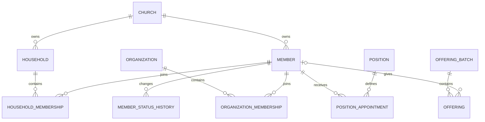

# 핵심 도메인 모델

## 관계 개요

## Aggregate 경계

### Member aggregate

- `Member`: 현재 최소 프로필과 현재 교적 상태
- `MemberStatusHistory`: 상태 변화의 append-only 이력
- 가족, 조직, 직분은 Member 내부 collection으로 숨기지 않고 별도 관계 aggregate에서 관리

### Household aggregate

- `Household`: 가족/세대 공통 정보
- `HouseholdMembership`: Member의 소속 기간과 가족 내 관계
- 대표자 변경도 유효기간 또는 audit event로 추적

### Organization aggregate

- `Organization`: 유형과 계층
- `OrganizationMembership`: Member의 조직별 역할과 소속 기간
- 계층 순환 검증은 조직 변경 transaction 안에서 수행

### Position aggregate

- `Position`: 직분 master와 정책
- `PositionAppointment`: Member에 대한 기간 기반 임명

### Offering aggregate

- `OfferingBatch`: 입력과 검수의 transaction boundary
- `Offering`: 개별 헌금 항목
- 게시 후 생성된 accounting reference를 보유하되 Accounting 내부 구현을 직접 수정하지 않음

## 공통 식별자와 시간

- 외부 노출 ID는 UUID를 기본으로 한다.
- 교회별 사람이 읽는 `member_number`는 별도 unique key다.
- 모든 기간 이력은 `effective_from`, `effective_to`를 사용한다.
- `created_at`, `updated_at`은 업무 적용일과 구분한다.
- 사용자 입력 사유는 code와 제한된 free text를 함께 사용할 수 있다.

## 삭제 정책

| 데이터 | 정책 |
|---|---|
| 잘못 만든 미사용 master | 권한 있는 soft delete 가능 |
| Member/Household | 비활성화, 병합 또는 상태 전환 |
| 기간 이력 | append-only 정정 |
| Posted finance | reversal만 허용 |
| AuditEvent | application에서 삭제 불가 |

## 아직 결정이 필요한 항목

- 교적번호 자동 생성 형식
- 가족 관계 코드와 세대주 표시 규칙
- 세례/입교/교육 이력을 별도 sacrament/education 모델로 분리할지 여부
- 이름의 한글/영문/검색용 정규화 방식
- 개인정보 보존과 파기 기간
