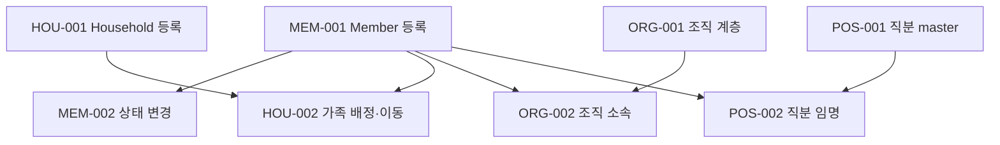

# Phase 1: 교적 Core Backlog

상태: **아래 Core 작업의 API·관리 화면·migration·권한·감사·테스트 구현 완료**

검증 범위와 운영 인계는 [구현 기록](implementation-status.md)을 따른다.

## 권장 순서

## MEM-001 교인 등록

- 최소 프로필과 교인번호를 등록한다.
- 동일 church 내 중복 교인번호를 거부한다.
- 최초 상태 이력을 같은 transaction에서 생성한다.
- 개인정보를 audit payload에 복제하지 않는다.

## MEM-002 교적 상태 변경

- 이전/신규 상태, 적용일, 사유를 입력한다.
- 현재 상태와 이력을 같은 transaction에서 갱신한다.
- 잘못된 상태 전이를 명시적 domain error로 거부한다.

## MEM-003 교인 검색과 상세 조회

- church scope와 permission 적용
- 이름/교인번호/연락처 normalized 검색
- cursor pagination
- 민감 필드별 response masking

## HOU-001 Household 등록

- 가족명, 공통 연락처, 주소를 선택적으로 등록한다.
- 빈 Household 생성은 허용하되 운영 정리 대상으로 식별한다.

## HOU-002 가족 배정과 이동

- Member를 Household에 배정하거나 다른 Household로 이동한다.
- 이전 membership 종료와 신규 membership 생성을 원자적으로 처리한다.
- 활성 membership 중복을 방지한다.
- 활성 구성원이 아닌 대표자를 지정할 수 없다.

## ORG-001 조직 계층

- 조직 종류와 조직을 생성한다.
- parent 이동과 폐쇄를 지원한다.
- 계층 순환을 거부한다.

## ORG-002 조직 소속

- Member를 하나 이상의 조직에 기간 기반으로 배정한다.
- 역할과 주 소속 여부를 기록한다.
- 과거 소속을 조회한다.

## POS-001 직분 master

- 교회별 직분을 생성·비활성화한다.
- 표시 순서와 중복 임명 정책을 정의한다.

## POS-002 직분 임명

- Member에게 직분을 임명·종료한다.
- 임명 조직과 적용 기간을 기록한다.
- 정책상 금지된 활성 중복을 거부한다.

## AUD-001 핵심 감사 이벤트

- Member 생성/수정/상태 변경
- Household 이동
- 조직 소속과 직분 변경
- 권한 실패와 대량 내보내기 시도

## Definition of Done

- 요구사항과 API 계약 반영
- migration과 seed/update 경로 제공
- domain/unit/integration test 추가
- 권한 및 다른 church scope 테스트 포함
- lint, typecheck, test, build 통과
- 관련 문서 갱신
